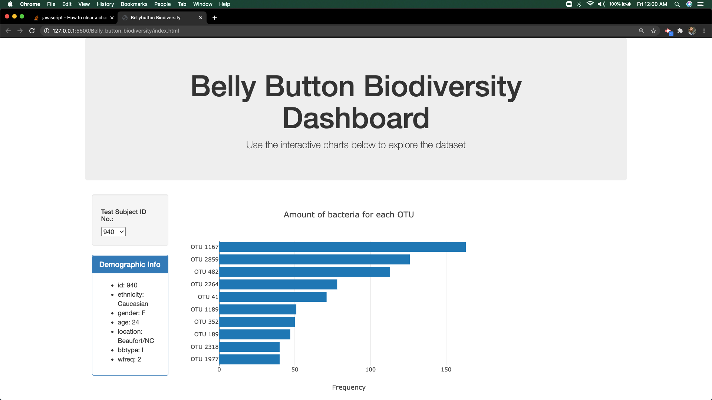
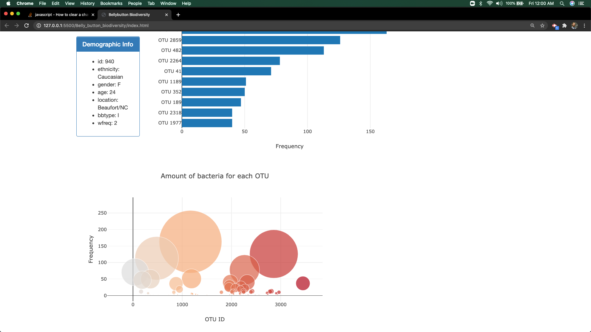
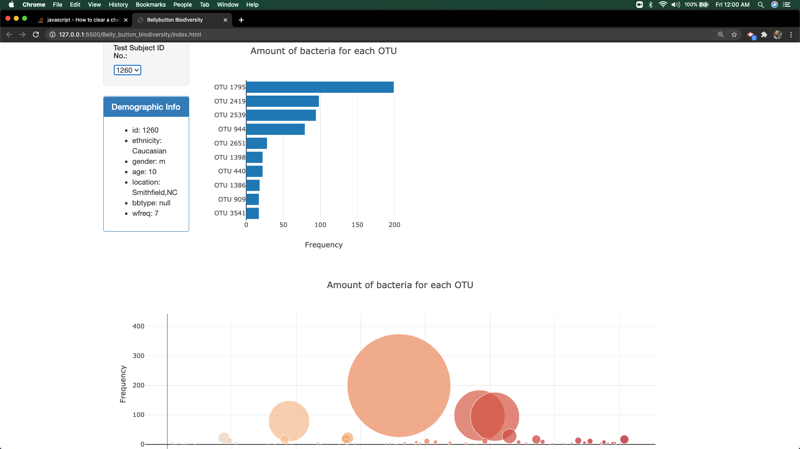

# plotly-challenge

In this project I use a JSON dataset that shows the amount of belly button bacteria for more than 100 randomly chosen patients. In each sample, there are numerous types of bacteria, and I just use the top 10 bacterias for each patient.

Using a combination of JavaScript, HTML, and CSS, I create an interactive dashboard that allows the user to choose any patient (by ID number) and view the top 10 bacteria counts for the patient. Using d3 within JS, I plot the results in a horizontal bar chart and a bubble chart.

